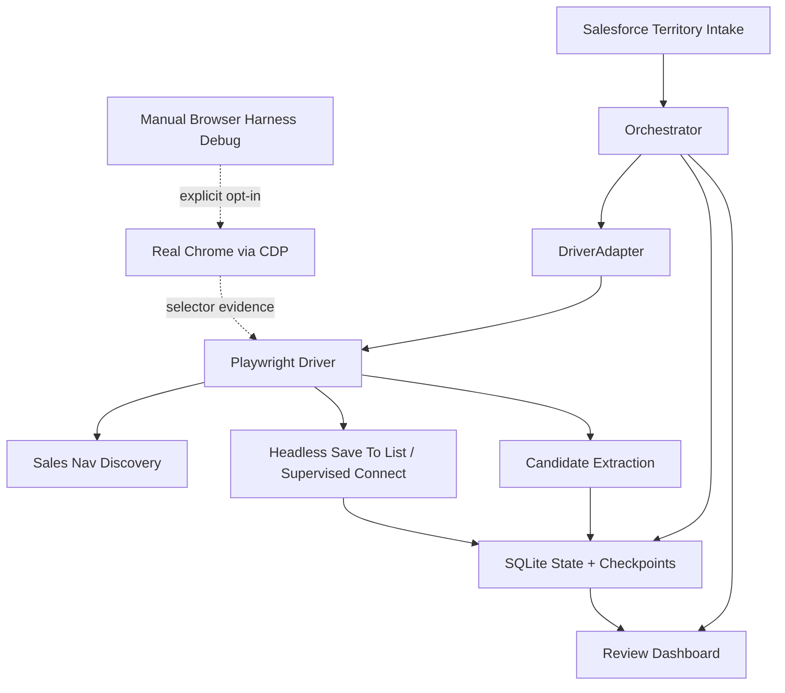

# Browser Harness Hybrid Stack

## Summary

The platform now supports a `hybrid` browser architecture:

- `PlaywrightSalesNavigatorDriver` remains the fast, structured discovery engine.
- `PlaywrightSalesNavigatorDriver` owns automated live mutations such as save-to-list and supervised connect attempts.
- `BrowserHarnessSalesNavigatorDriver` is retained as an explicit manual diagnostic tool for observing fragile UI shapes.
- `HybridSalesNavigatorDriver` combines both behind the existing `DriverAdapter` interface.

## Why this exists

Our platform already had the right operational structure:

- territory intake
- account-first orchestration
- SQLite state
- review dashboard
- approval queue
- pacing and dedupe

What it lacked was a safe boundary for browser work that is:

- fast enough for automated background research
- predictable for live mutations
- still debuggable when LinkedIn changes a UI shape

Playwright fills the automated path. Browser Harness fills the manual observation gap without owning production mutations.

## Current driver split

### Playwright owns

- account traversal
- people search
- template application
- candidate extraction
- structured evidence capture from known Sales Navigator DOMs
- automated save-to-list flows
- supervised connect flows when explicitly requested

### Browser Harness owns

- attach to the user's real Chrome through CDP
- manual UI inspection when Playwright selectors need repair
- evidence gathering for fragile LinkedIn UI variants
- one-off operator-driven debugging via explicit `--driver=browser-harness`

### Hybrid owns

- one `DriverAdapter` surface to the orchestrator
- Playwright for discovery methods
- Playwright for mutation methods
- no automatic Browser Harness subprocesses

## Practical stack

## Recommended operating mode

### Default for runs

Use `--driver=playwright` for automated live-save/live-connect work. `--driver=hybrid` remains compatible, but it is Playwright-backed for both discovery and mutation.

### Use `playwright` alone when

- doing pure discovery tuning
- testing DOM extraction speed
- running dry-run candidate harvesting only

### Use `browser-harness` alone when

- checking direct Chrome attach behavior
- debugging fragile UI behavior in the user's real browser
- collecting selector evidence for a Playwright fix
- running a manual repair session with the operator watching

## Known limitations

- Browser Harness is intentionally not the automated mutation engine.
- LinkedIn-specific Browser Harness domain skills may help diagnose UI changes, but shipped automation should land in Playwright.
- Cloud-profile sync is intentionally not part of the default production path for LinkedIn.

## Next build steps

1. Keep Playwright list-save and supervised connect flows as the production path.
2. Use Browser Harness only to observe new LinkedIn UI shapes and translate findings back into Playwright selectors.
3. Add release tests that prevent automated flows from depending on a local `browser-harness` binary.
4. Keep explicit `--driver=browser-harness` available for manual diagnostics, not unattended runs.
