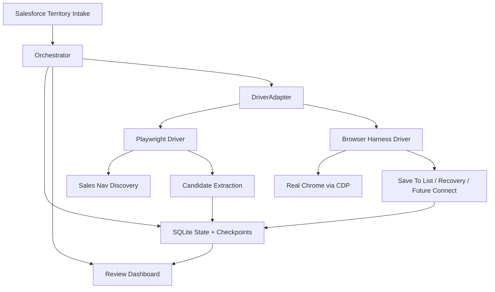

# Browser Harness Hybrid Stack

## Summary

The platform now supports a `hybrid` browser architecture:

- `PlaywrightSalesNavigatorDriver` remains the fast, structured discovery engine.
- `BrowserHarnessSalesNavigatorDriver` adds direct-CDP control of the user's real Chrome for fragile live actions.
- `HybridSalesNavigatorDriver` combines both behind the existing `DriverAdapter` interface.

## Why this exists

Our platform already had the right operational structure:

- territory intake
- account-first orchestration
- SQLite state
- review dashboard
- approval queue
- pacing and dedupe

What it lacked was a second execution path for browser work that is:

- closer to the user's real browser session
- more tolerant of odd UI flows
- better suited for mutation-heavy tasks like `save to list`

Browser Harness fills that gap without replacing the platform.

## Current driver split

### Playwright owns

- account traversal
- people search
- template application
- candidate extraction
- structured evidence capture from known Sales Navigator DOMs

### Browser Harness owns

- attach to the user's real Chrome through CDP
- session verification in a real browser context
- mutation-oriented flows such as `saveCandidateToList`
- recovery screenshots in the real browser context
- future path for fragile connect/dialog flows

### Hybrid owns

- one `DriverAdapter` surface to the orchestrator
- Playwright for discovery methods
- Browser Harness for mutation methods
- health gating that can require both layers for live mutation runs

## Practical stack

## Recommended operating mode

### Default for runs

Use `--driver=hybrid` for production-oriented discovery runs where list-save matters.

### Use `playwright` alone when

- doing pure discovery tuning
- testing DOM extraction speed
- running dry-run candidate harvesting only

### Use `browser-harness` alone when

- checking direct Chrome attach behavior
- testing a live save-to-list flow
- debugging fragile UI behavior in the user's real browser

## Known limitations

- Browser Harness is not yet the primary discovery engine.
- The harness integration currently prioritizes session, mutation, and recovery paths.
- LinkedIn-specific Browser Harness domain-skills are not yet authored in this repo.
- Cloud-profile sync is intentionally not part of the default production path for LinkedIn.

## Next build steps

1. Add a dedicated `linkedin-sales-navigator` Browser Harness skill pack.
2. Expand harness-backed list-save handling with LinkedIn-specific selectors and waits learned from live tests.
3. Add harness-backed connect dialog handling only after list-save is stable.
4. Optionally add a fallback policy so Playwright discovery failures can trigger Browser Harness recovery flows automatically.
